# Ben Juntilla's HW2

## UML Diagrams

### Question Class

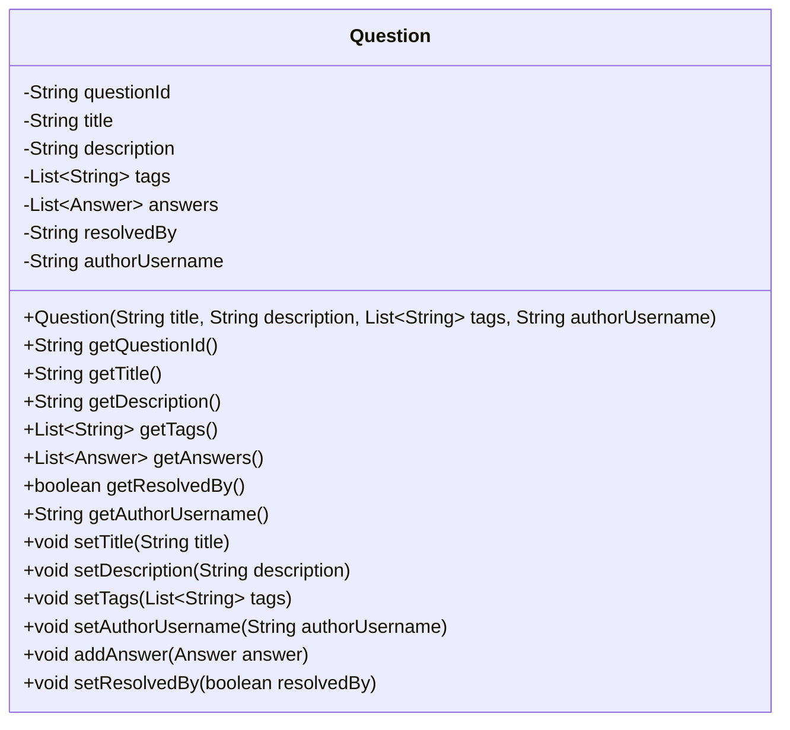

### Answer Class

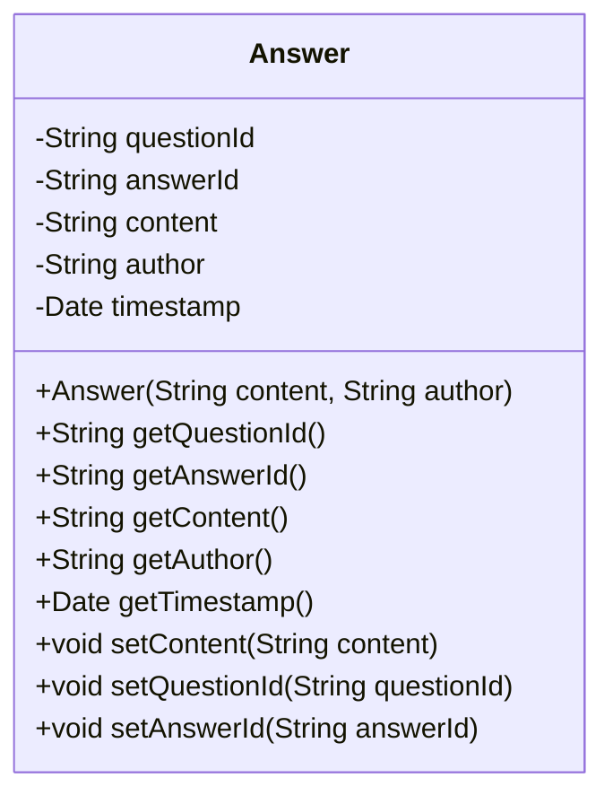

### Questions List Class

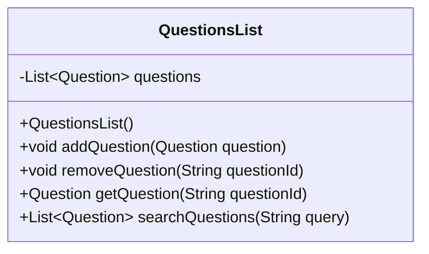

### Answers List Class

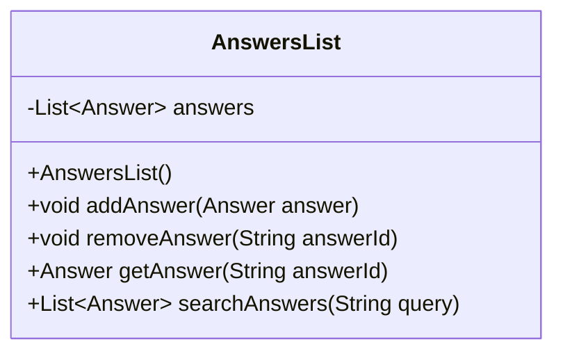

### Sequence Diagram for Creating a Question

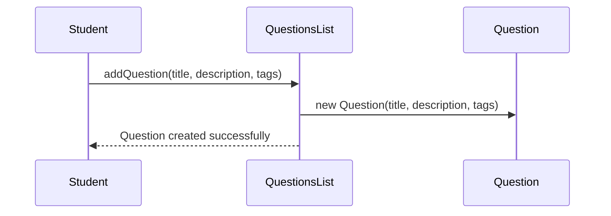

### Sequence Diagram for Reading a Question

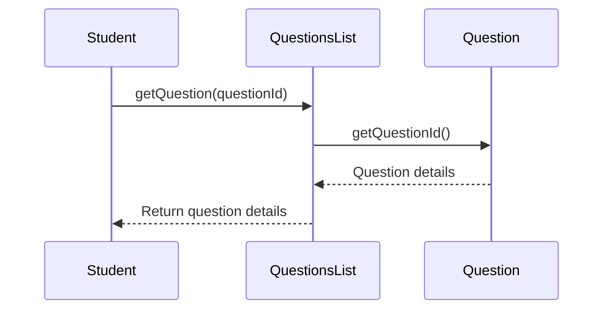

### Sequence Diagram for Updating a Question

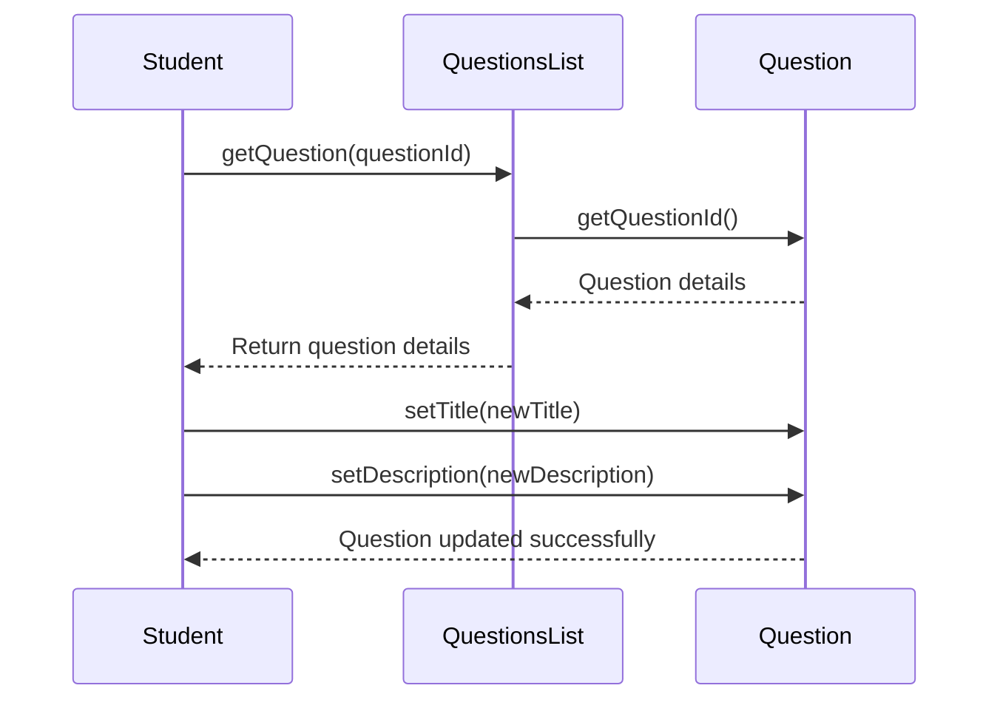

### Sequence Diagram for Deleting a Question

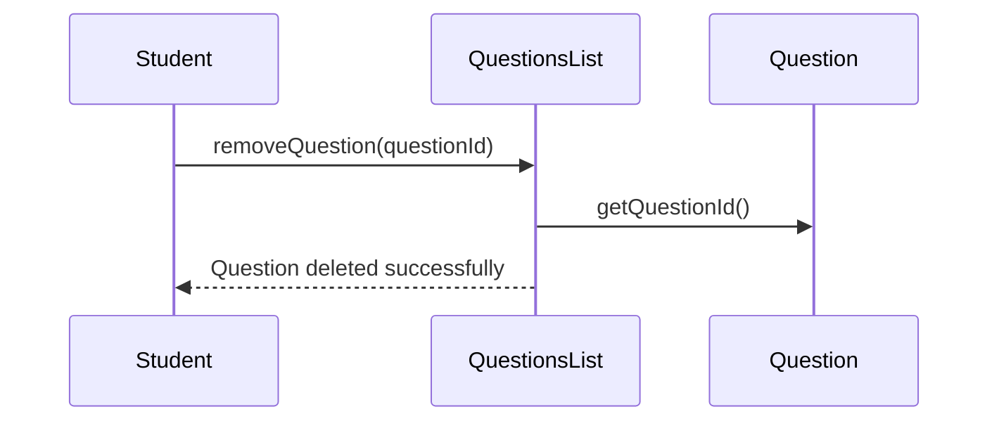

### Sequence Diagram for Creating an Answer

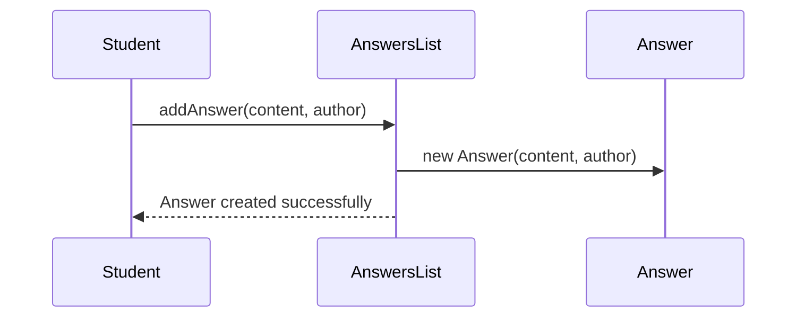

### Sequence Diagram for Reading an Answer

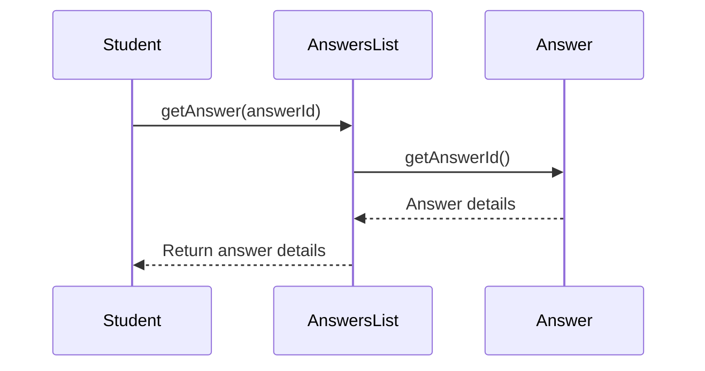

### Sequence Diagram for Updating an Answer

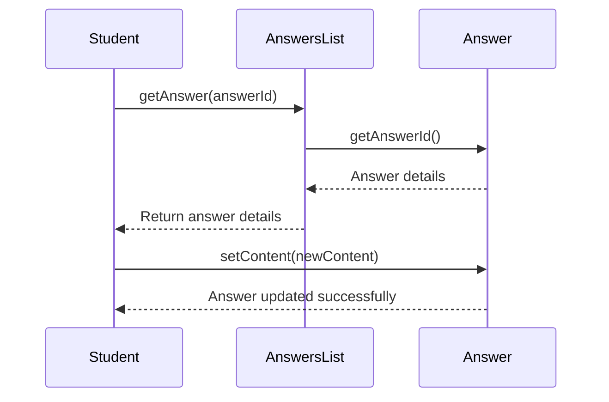

### Sequence Diagram for Deleting an Answer

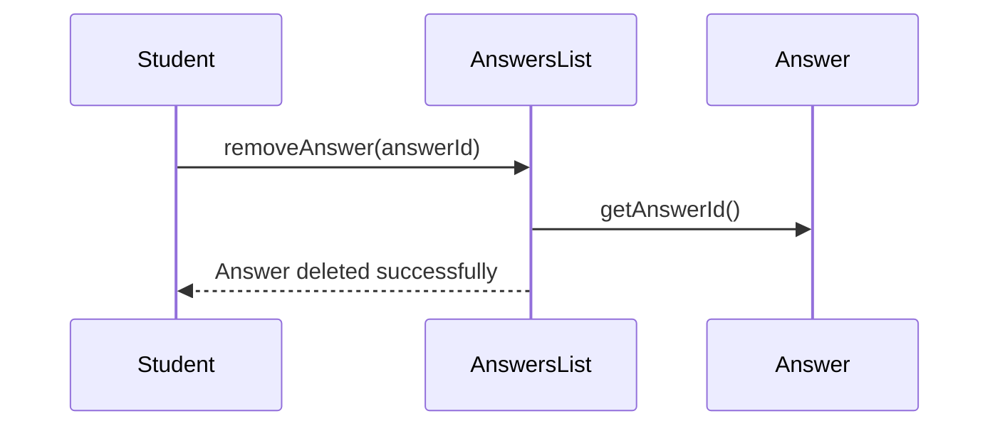
